# Predictive-Modeling-With-Logistic-Regression

Predictive modeling with logistic regression is a statistical technique used to predict the probability of a binary outcome based on one or more predictor variables. It is commonly employed when the dependent variable (the outcome) is binary, meaning it can only take two possible values, such as "yes" or "no," "success" or "failure," "1" or "0," etc. The goal of logistic regression is to find a mathematical relationship between the predictor variables and the binary outcome by estimating the probability that the outcome belongs to a particular category, usually represented by the value 1. The output of the logistic regression model is a probability score that indicates the likelihood of the event occurring.

How logistic regression works:
* Data Preparation: Gather a dataset that includes the binary outcome variable and one or more predictor variables (also called independent variables or features). The data should be divided into a training set and a test set for model development and evaluation, respectively.
* Sigmoid Function: Logistic regression uses the logistic function (also called the sigmoid function) to model the relationship between the predictor variables and the binary outcome. The sigmoid function maps any real-valued number to a value between 0 and 1, which is suitable for representing probabilities.
  * The sigmoid function is defined as: σ(z)=11+e−zσ(z)=1+e−z1​
  * Where: zz is the linear combination of the predictor variables and their corresponding coefficients.
* Model Training: The logistic regression model aims to find the best-fitting coefficients for the predictor variables to maximize the likelihood of the observed outcomes in the training data. This process is typically performed using optimization techniques such as gradient descent.
* Making Predictions: Once the model is trained, it can be used to make predictions on new data. The logistic regression model takes the values of the predictor variables for each data point, calculates the linear combination with the learned coefficients, and then applies the sigmoid function to obtain the probability score.
* Decision Threshold: To convert the probability score into a binary outcome prediction, a decision threshold is used. By default, the threshold is set to 0.5, meaning that if the predicted probability is greater than or equal to 0.5, the outcome is predicted as 1; otherwise, it is predicted as 0. However, the decision threshold can be adjusted based on the specific needs of the application or to balance between precision and recall.
* Model Evaluation: To assess the performance of the logistic regression model, it is evaluated using various metrics such as accuracy, precision, recall, F1 score, and ROC-AUC.

Logistic regression is a fundamental and widely used method for predictive modeling, especially when dealing with binary classification problems. However, when the dependent variable has more than two categories, other techniques like multinomial logistic regression or support vector machines are used.

### Environment
* Python
* Jupyter Notebook

### Libraries
* Pandas
* Numpy
* Matplotlib
* Seaborn
* Sci-kit Learn
* Imbalanced Learn

### Data Ingestion
The data is read into the Jupyter Notebook using the Pandas read_csv() method. 
```
df = pd.read_csv('churn_clean.csv')
```
### Data Exploration
The dataset contains customer records from a telecommunications company in a CSV file. The 10,000 customer records are described by 50 attributes. Using the columns and shape commands, this is shown in the notebook.
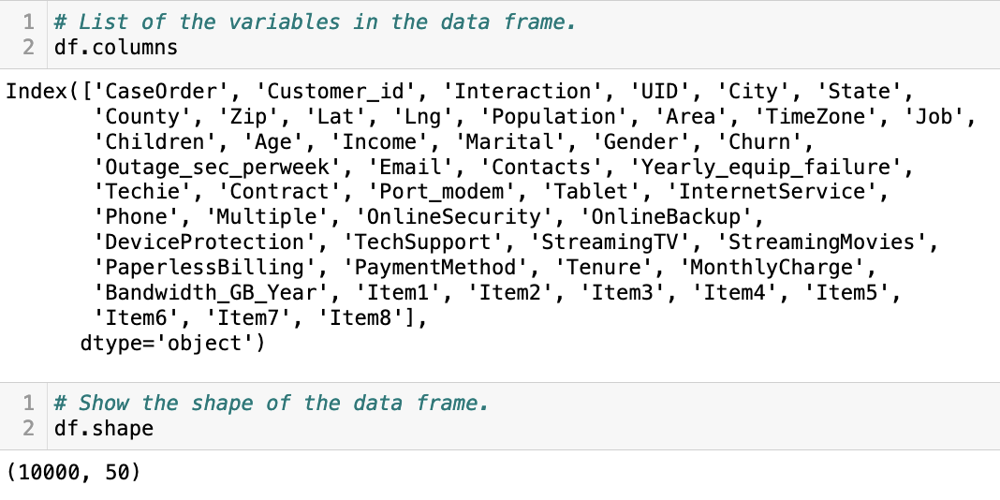

### Data Cleaning
The data is currently raw and needs a little manipulation to prepare it for modeling. The last eight columns are responses from a customer satisfaction survey currently labeled item 1 through item 8. These columns are renamed to the label provided in the data dictionary for the dataset using the rename() method. 
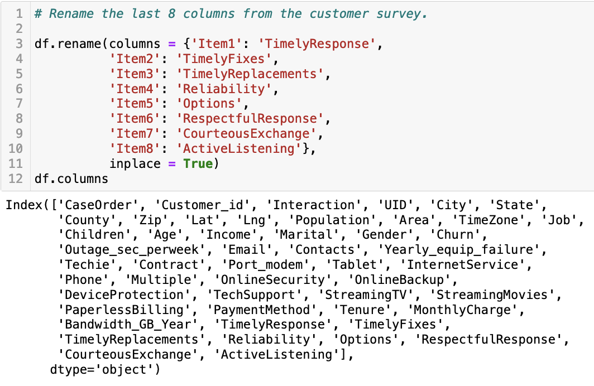

The isnull() and sum() methods are combined to check for missing values in the data. The results show no missing fields. Next, duplications are checked for in the columns and rows. This yields no duplicated data for this dataset. In preparation for logistic regression, columns with a high degree of cardinality are removed using the drop() method. The outlying values are detected using the caculation of a z-score. The data with scores below 3 are filtered from the dataframe. 

### Target Variable
This analysis will be targeting the variable of churn. This is a categorical variable with a yes and no indicator if the customer has left the company's service or is currently a customer. From the bar chart, we can see that there are 6739 current customers and 2436 customers who have discontinued their service with the provider. This gives a ratio of 26.6% of customers who churned. 
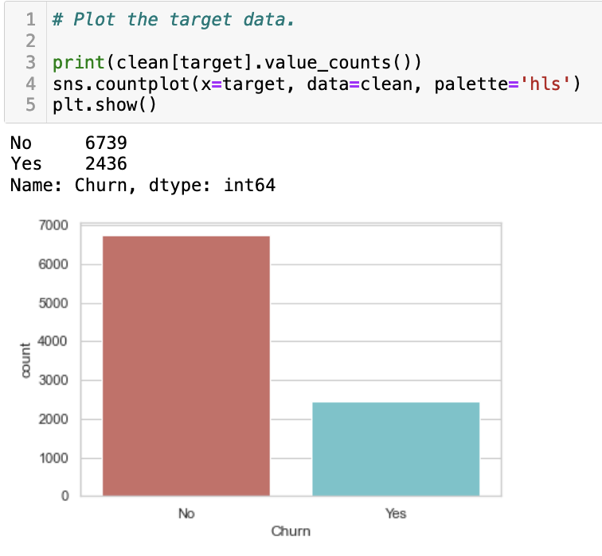

### Categorical Variables
The categorical variables are separated from the numerical ones and compared to the target in bar charts.
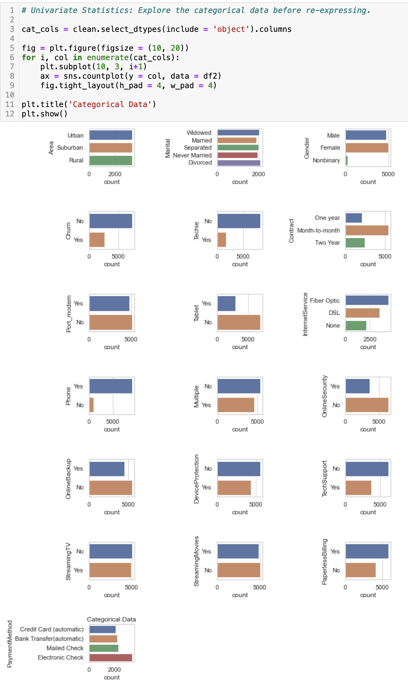

There are too many payment methods, so they can be reduced and recategorized into Automatic and Check. Also, the marital categories can be reduced to Married and Not_Married. Next, the categorical variables are re-expressed as numerical figures using the get_dummies() method. 

### Numeric Variables
The numeric data is now looked at using the describe() method to show the statistics for each variable.
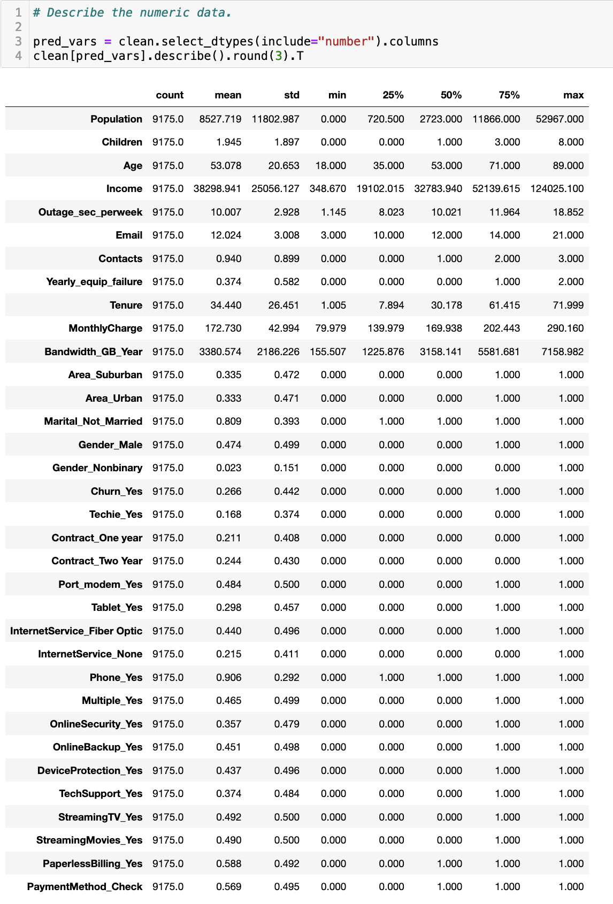

Histograms are plotted to show the distribution of the numeric data.


### Initial Predictive Model
The data is rebalanced using the Synthetic Oversampling Technique or SMOTE technique from Imbalanced Learning.
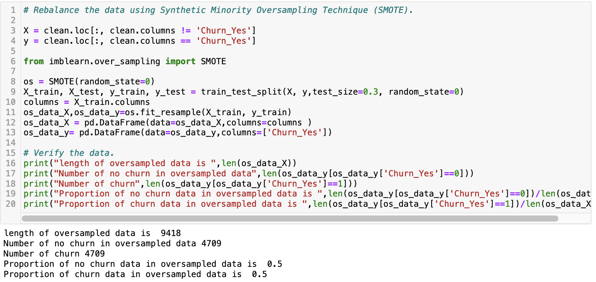

A Recursive Feature Elimination (RFE) is used to rank the features for reduction.
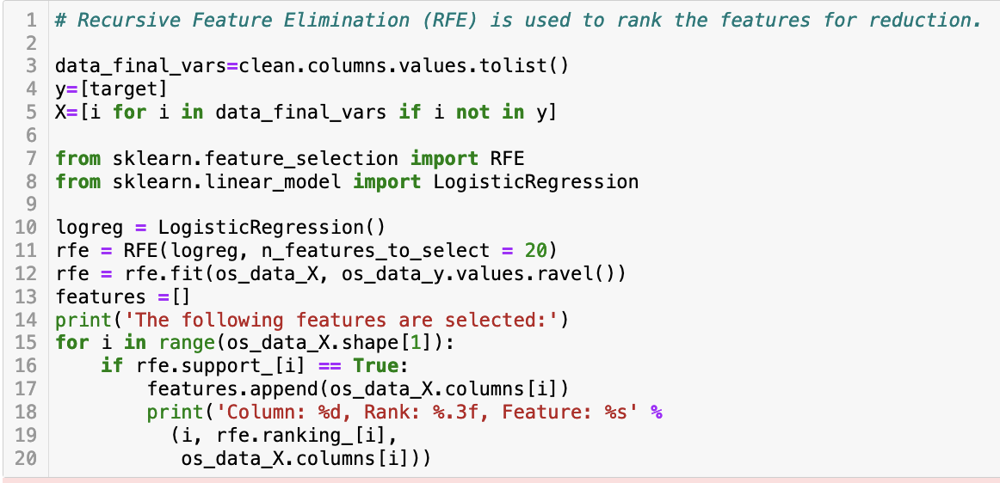
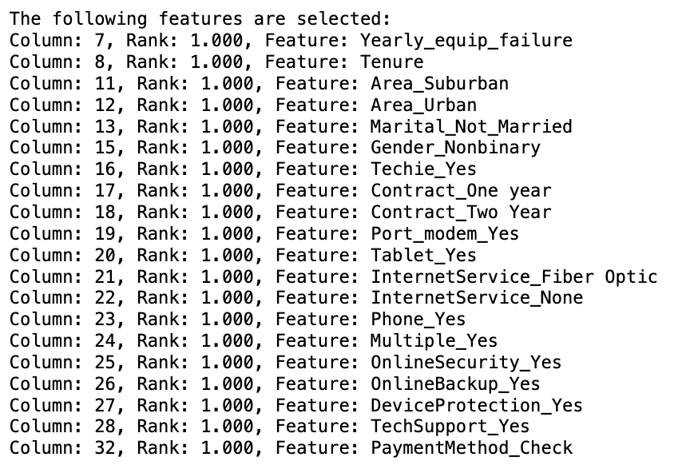

The top features are extracted using the ranking.
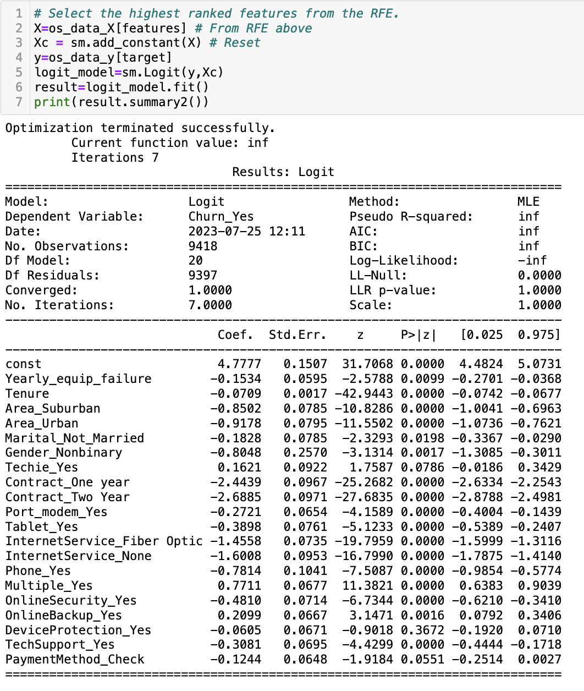

A confusion matrix for the model is created to see the correlation. 
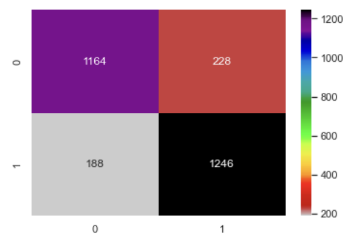

Correct and incorrect predictions are calculated.
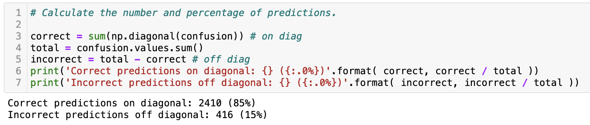

Pairs of highly correlated predictions are found.
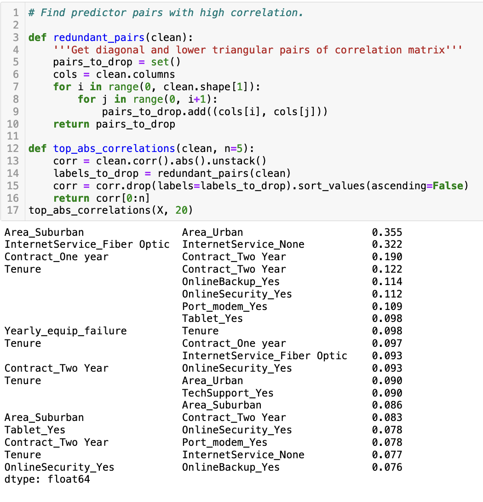

### Reduced Predictive Model
Features with high p-values or high multicollinearity are removed and a reduced model is created.
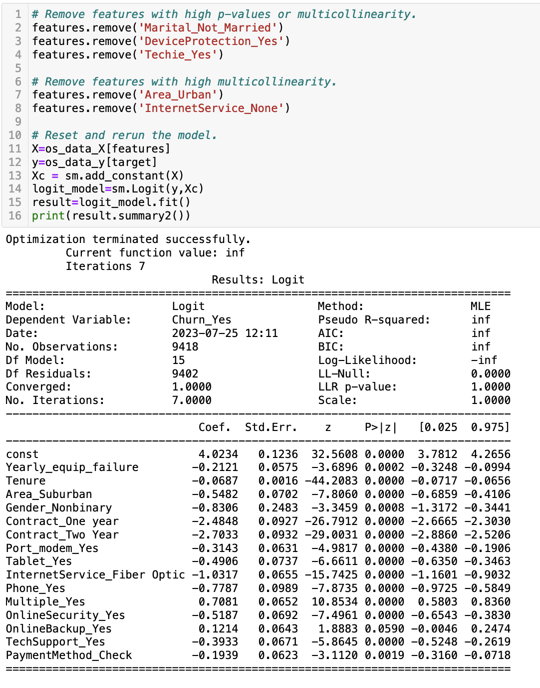

A confusion matrix for the reduced model is created.
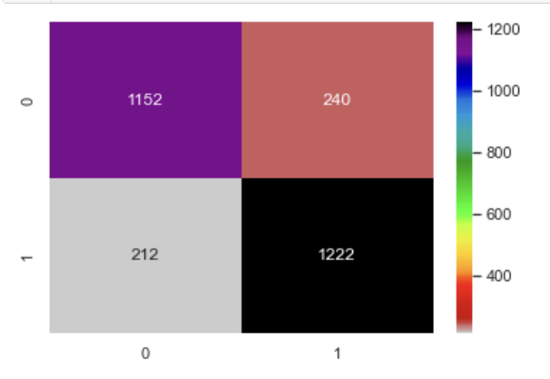

Correct and incorrect predictions are calculated for the reduced model.
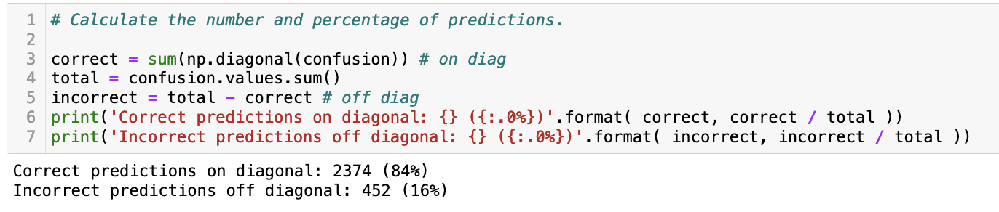

### Results
A Classification Report is created and the model scores an 84% accuracy score.
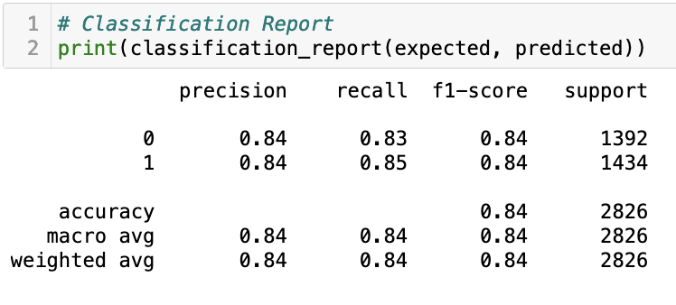

The Receiver Operating Characteristic (ROC) curve is plotted for the model.
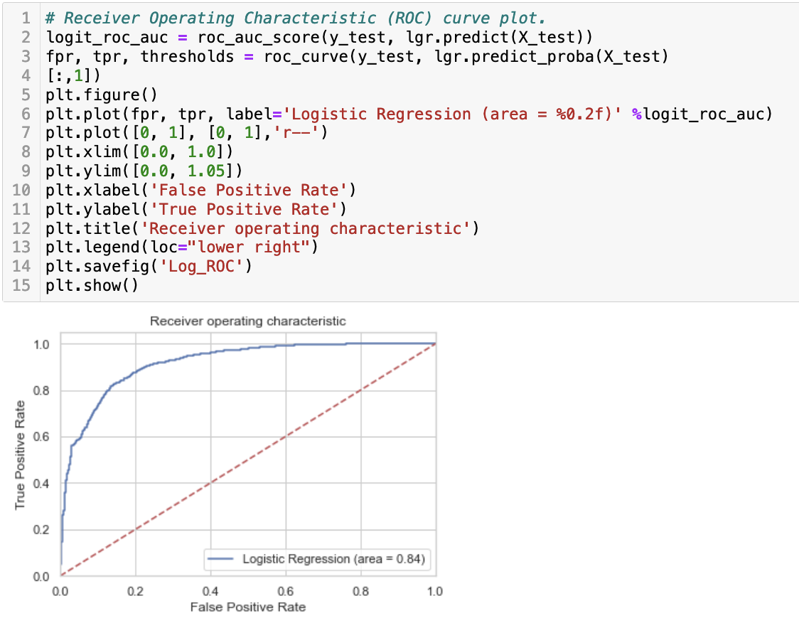

A regression line equation is created for the reduced model and the logarithm coefficient is plotted using exp(x) plot.
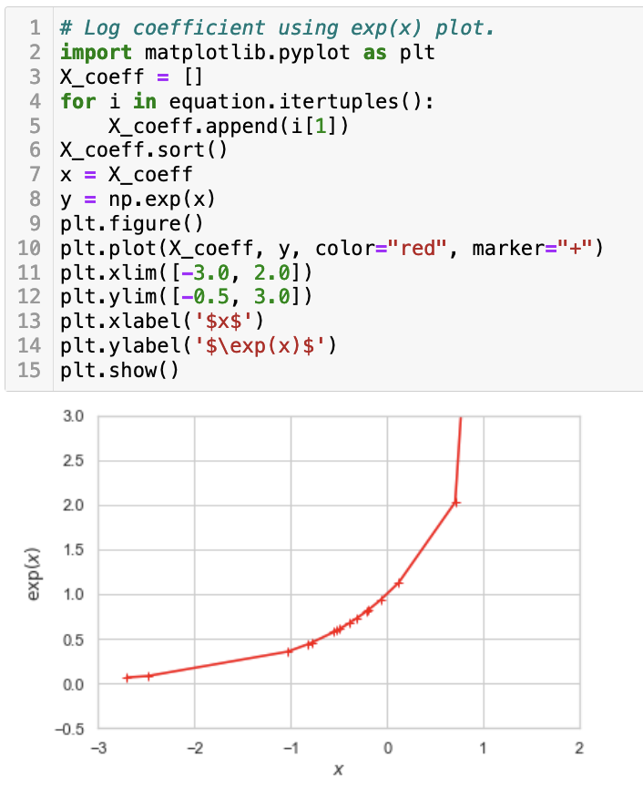
